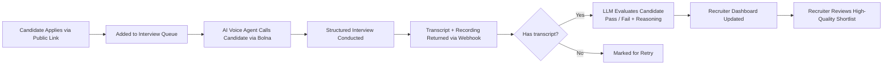

# AI Screening — Product Overview

## The Enterprise Problem

Hiring at scale is broken. Every enterprise posting a mid-to-senior role receives **hundreds to thousands of applications** within days. Talent teams spend a disproportionate amount of time on repetitive first-round screening calls — asking the same structured questions, manually taking notes, and chasing candidates who never pick up the phone. This creates three compounding pain points:

| Pain Point | Business Impact |
|---|---|
| **Recruiter bandwidth bottleneck** | A single recruiter can realistically screen 10–15 candidates/day. With 500 applicants, that's weeks of delay before any hiring decision |
| **Inconsistent evaluation** | Human interviewers vary in tone, depth, and bias — making comparison across candidates unreliable |
| **Candidate drop-off** | Scheduling friction (email tags, calendar coordination, time zones) causes 30–50% of top candidates to fall out before the first call |

The result: **slow time-to-hire, high recruiter costs, and inconsistent candidate quality assessments** — all before a hiring manager ever sees a resume.

---

## The Solution

**AI Screening** is an end-to-end automated candidate screening platform that replaces the first-round phone interview with an AI voice agent. When a candidate applies to a job, the platform autonomously:

1. **Calls the candidate** via an AI voice agent (powered by [Bolna](https://bolna.ai)) — no scheduling needed
2. **Conducts a structured interview** tailored to the job's required skills, experience level, and responsibilities
3. **Transcribes and evaluates** the conversation using an LLM to produce a pass/fail verdict with detailed reasoning
4. **Surfaces results** to the recruiter in a dashboard — ready for review within minutes of the call ending

Recruiters only spend time on candidates who have **already been pre-qualified by AI**.

---

## How It Works

### Key Components

- **Public Apply Page** — A branded, job-specific application form (customisable fields per job). Zero friction for candidates.
- **Background Queue Worker** — Sequentially initiates calls to avoid rate-limiting, with retries for unanswered/disconnected calls.
- **Bolna Voice AI** — Conducts the phone interview using job-specific context (role, skills, experience level, company). Supports dynamic prompting per job.
- **Webhook Handler** — Receives call outcomes in real time. Handles edge cases: disconnected calls with a transcript are still processed by the AI evaluator.
- **LLM Evaluation Engine** — Uses GPT-4 to analyse the transcript against job requirements, returning a structured `pass`/`fail` with human-readable reasoning.
- **Admin Dashboard** — Recruiters see candidate status (applied → calling → completed), AI verdict, transcript, and reasoning. Failed/disconnected candidates can be manually re-queued.

---

## Enterprise Value Proposition

> **10x the screening throughput. Zero scheduling overhead. Consistent, auditable evaluations.**

| Metric | Manual Process | With AI Screening |
|---|---|---|
| Candidates screened per day | ~12 per recruiter | Unlimited (async, parallel) |
| Time to first evaluation | 3–5 days | < 15 minutes |
| Consistency | Varies by interviewer | Deterministic, structured |
| Cost per screen | ~$30–$60 (recruiter time) | Cents (API cost) |
| Candidate experience | Scheduling friction | Instant, on-demand call |

---

## Who It's For

- **High-volume hiring teams** (tech companies, BPOs, retail, logistics) processing 50–500+ applicants per role
- **Staffing agencies** managing multi-client pipelines simultaneously
- **Startups scaling rapidly** without the budget to hire large HR teams
- **Remote-first companies** where timezone mismatches make scheduling painful

---

## Competitive Differentiation

Unlike ATS tools (Greenhouse, Lever) that just track applicants, or video-screening tools (HireVue) that require candidates to self-record, AI Screening:

- **Calls the candidate** — no app download, no login, no scheduling
- **Is fully asynchronous** — works 24/7, across time zones
- **Produces structured AI reasoning**, not just a sentiment score
- **Is deeply customisable per job** — skills, requirements, and questions are dynamic
- **Handles real-world call failures** gracefully (retry on disconnect, process partial transcripts)
